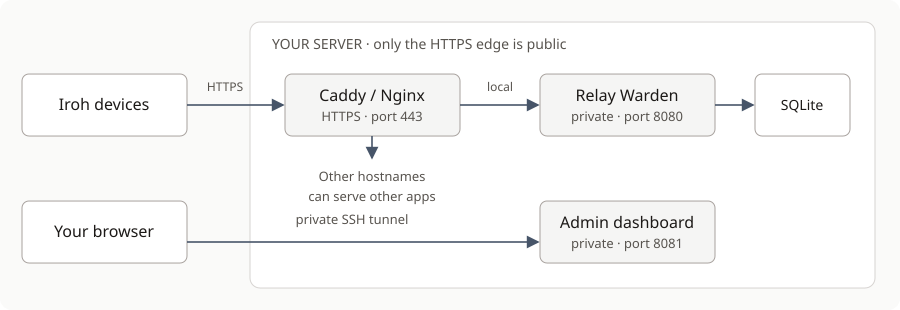

# Deploy your relay

[Home](../README.md) → Deploy → [Use the dashboard](USAGE.md)

This guide installs Relay Warden on Ubuntu 24.04, gives it an HTTPS hostname,
and keeps administration private. Run server commands in your SSH session.
Steps marked **on your computer** belong in a separate local terminal.

## Before you start

You need a 64-bit Ubuntu 24.04 server, SSH access with `sudo`, and a hostname
you control, such as `relay.example.com`. Release archives support x86-64 and
ARM64; older glibc systems and Alpine are not supported by these binaries.

Choose a traffic budget from your provider's allowance, leaving room for your
other services. The example uses **100 GB per month** and **100 KB/s per
device**. These are example limits, not a recommended cloud plan.



Only TCP 80 and 443 are public for the relay's HTTPS setup. Keep your SSH
access; do not expose ports 8080 or 8081. This installation does not provide a
UDP discovery service.

## 1. Download a release

**On the server**, check the CPU:

```sh
uname -m
```

| Output | Archive to choose |
|---|---|
| `x86_64` | Ends in `x86_64-unknown-linux-gnu.tar.gz` |
| `aarch64` | Ends in `aarch64-unknown-linux-gnu.tar.gz` |

Open [Releases](https://github.com/sudosylabs/relay-warden/releases/latest),
expand **Assets**, and copy the link to the matching archive. Do not choose
GitHub's generated “Source code” archive.

Install the download tools and work in a fresh directory:

```sh
sudo apt-get update
sudo apt-get install -y curl ca-certificates
WARDEN_WORK="$(mktemp -d)"
cd "$WARDEN_WORK"
```

Replace the value below with the archive link you copied:

```sh
WARDEN_URL='PASTE_THE_ARCHIVE_LINK_HERE'
WARDEN_ARCHIVE="${WARDEN_URL##*/}"
curl --fail --location --output "$WARDEN_ARCHIVE" "$WARDEN_URL"
curl --fail --location --output SHA256SUMS "${WARDEN_URL%/*}/SHA256SUMS"
```

Verify **this archive's** checksum:

```sh
awk -v name="$WARDEN_ARCHIVE" '$2 == name' SHA256SUMS | sha256sum --check -
```

You should see the archive name followed by `OK`. Stop if verification fails
or no matching checksum is found. Get both files from the same release;
checksums detect corruption, not publisher identity.

```sh
tar -xzf "$WARDEN_ARCHIVE"
cd "${WARDEN_ARCHIVE%.tar.gz}"
./relay-warden --version
```

Keep this terminal in the extracted directory for steps 2–4. The archive
includes the executable, configuration, service, proxy examples, and guides.

## 2. Install the executable and create its account

These commands are for a **new installation**. If you already have one,
follow [Upgrade](OPERATIONS.md#upgrade) instead; keep its database and tokens.

```sh
sudo useradd --system --user-group --shell /usr/sbin/nologin relay-warden
sudo install -d -m 755 /opt/relay-warden /etc/relay-warden
sudo install -d -o relay-warden -g relay-warden -m 750 /var/lib/relay-warden
sudo install -m 755 ./relay-warden /opt/relay-warden/relay-warden
```

Create the private admin credential. There is no default password.

```sh
sudo sh -c 'umask 077; head -c 32 /dev/urandom | base64 > /var/lib/relay-warden/admin.token'
sudo chown relay-warden:relay-warden /var/lib/relay-warden/admin.token
sudo install -o root -g relay-warden -m 640 warden.example.toml /etc/relay-warden/warden.toml
```

The executable lives in `/opt/relay-warden`. The database and token live in
`/var/lib/relay-warden`; keep that directory when upgrading.

## 3. Choose access, speeds, and a budget

```sh
sudoedit /etc/relay-warden/warden.toml
```

Check these values **before the first start**:

```toml
listen = "127.0.0.1:8080"
admin_listen = "127.0.0.1:8081"

require_endpoint_approval = false
default_rx_bps = 100_000
default_tx_bps = 100_000

quota_budget_bytes = 100_000_000_000
quota_headroom_bytes = 1_000_000_000
quota_overhead_pct = 10
```

This allows public access, caps each ordinary device at 100 KB/s in each
direction, and stops relaying at 99 GB of charged usage. The 10% overhead
allowance is included in that usage. Replace the speeds and budget with your
own allocation. Both sides of a relayed exchange can consume charged bytes;
a 100 GB budget is not a promise to deliver 100 GB of file contents.

Want approval instead? Set `require_endpoint_approval = true`. For a shared
relay token, follow [Choose an access policy](USAGE.md#choose-an-access-policy).

At the existing `[network]` section, replace its `trusted_proxies` line with:

```toml
[network]
trusted_proxies = ["127.0.0.1"]
```

Do not add a second `[network]` section. This trusts the local Caddy proxy
configured in step 5, so the dashboard and IP limits use the client's IP,
not Caddy's loopback address. Never add arbitrary public IPs here. For a
different proxy layout, see [network safeguards](CONFIGURATION.md#network-safeguards).

Leave `require_default_limits` and `require_quota_budget` enabled. They catch
missing limits at startup. Other options are in the
[configuration reference](CONFIGURATION.md).

## 4. Start Relay Warden

Still in the extracted archive directory:

```sh
sudo install -m 644 relay-warden.service /etc/systemd/system/relay-warden.service
sudo systemctl daemon-reload
sudo systemctl enable --now relay-warden
sudo systemctl status relay-warden --no-pager
curl --fail http://127.0.0.1:8080/healthz
```

The service should be `active (running)` and the health response should
contain `"status":"ok"`. If not, read the error before proceeding:

```sh
sudo journalctl -u relay-warden -n 50 --no-pager
```

Check that the backend and admin ports are private:

```sh
sudo ss -ltnp '( sport = :8080 or sport = :8081 )'
```

Both should bind to `127.0.0.1`, not `0.0.0.0` or `[::]`.

## 5. Give it HTTPS

Create an **A record** for `relay.example.com` pointing to the server's public
IPv4 address. Add an AAAA record only if that IPv6 address also reaches this
server. Allow inbound **TCP 80 and 443** in both the host firewall and your
provider's firewall/security rules. Keep rules for existing services and SSH.

### With Caddy

If Caddy is already installed, skip the package commands below. If another proxy already
owns ports 80/443, keep it and use the Nginx option below or adapt its routing;
do not start a second proxy on the same ports.

For a fresh Caddy installation, use its
[official Ubuntu package repository](https://caddyserver.com/docs/install#debian-ubuntu-raspbian):

```sh
sudo apt-get install -y debian-keyring debian-archive-keyring apt-transport-https curl gnupg
curl -1sLf 'https://dl.cloudsmith.io/public/caddy/stable/gpg.key' | sudo gpg --dearmor -o /usr/share/keyrings/caddy-stable-archive-keyring.gpg
curl -1sLf 'https://dl.cloudsmith.io/public/caddy/stable/debian.deb.txt' | sudo tee /etc/apt/sources.list.d/caddy-stable.list
sudo chmod o+r /usr/share/keyrings/caddy-stable-archive-keyring.gpg /etc/apt/sources.list.d/caddy-stable.list
sudo apt-get update
sudo apt-get install -y caddy
```

This installs the `caddy` systemd service. Now edit its site configuration:

```sh
sudoedit /etc/caddy/Caddyfile
```

Add this site block, replacing the hostname. **Keep existing site blocks.**

```caddyfile
relay.example.com {
    @iroh path /relay /ping
    handle @iroh {
        reverse_proxy 127.0.0.1:8080
    }
    handle {
        respond "Not found" 404
    }
}
```

Caddy obtains and renews the certificate automatically when DNS and ports are
correct. Its reverse proxy handles WebSocket upgrades and forwards the client
IP. [Caddy HTTPS](https://caddyserver.com/docs/quick-starts/https) ·
[Proxy behavior](https://caddyserver.com/docs/caddyfile/directives/reverse_proxy)

```sh
sudo caddy validate --config /etc/caddy/Caddyfile
sudo systemctl reload caddy
```

Run the reload only if validation succeeds. Do not proxy port 8081 or add an
admin route to this public site.

### With an existing Nginx installation

Use `nginx.example` from the archive. It needs an existing TLS certificate
and the `map` directive in Nginx's `http` context. Replace the hostname and
certificate paths; add the server block without replacing other sites.
The example overwrites `X-Forwarded-For` with `$remote_addr` for a direct
internet-facing Nginx on this server. Keep `trusted_proxies = ["127.0.0.1"]`
in Relay Warden. Additional proxy hops need their own explicit trust setup.

```sh
sudo nginx -t
sudo systemctl reload nginx
```

Run the reload only after a successful config test.

### Check the public route

**On your computer**, replace the hostname and run:

```sh
curl --fail --include https://relay.example.com/ping
```

Expect `HTTP/2 200` or `HTTP/1.1 200` with a valid certificate; the body is
empty. This checks HTTPS reachability, not a complete relay transfer.
`https://relay.example.com/admin/` must **not** show the admin page. With the
Caddy block above it returns 404. The public `/healthz` path is intentionally
not routed; use the backend health check from step 4.

## 6. Open the private admin page

**On your computer**, leave this running in a separate terminal:

```sh
ssh -N -L 18081:127.0.0.1:8081 you@your-server
```

Replace `you@your-server` with your usual SSH login. Then open
[http://127.0.0.1:18081/admin/](http://127.0.0.1:18081/admin/).
The tunnel connects your local browser to the server's private admin port.

In your **server SSH session**, display your admin token privately:

```sh
sudo cat /var/lib/relay-warden/admin.token
```

Paste it into **Admin token** and sign in. Store it in your password manager;
do not share it with relay users or include it in reports or screenshots.
Sessions last one hour and end when the server restarts.

On **Overview**, check the access mode and monthly budget you chose.

## 7. Connect an app and verify traffic

Configure your Iroh application to use **`https://relay.example.com`** as its
relay URL. This is an app setting: starting Relay Warden does not change
existing apps. For Rust apps, follow Iroh's
[custom relay configuration](https://docs.rs/iroh/latest/iroh/enum.RelayMode.html).
Use the SDK documentation matching your application's Iroh version.

If approval is enabled, make the app attempt a connection, approve its ID in
**Access requests**, and reconnect it. If a relay token is configured, the
app must send that token; never give it your admin token.

Test between two app instances. Verify the app reports a **relayed** path
through this hostname, then send data and check that charged usage increases
in **Overview**. A successful direct connection alone does not test the relay.
An app without custom-relay support needs an application change first.

For a protocol-level check from a source checkout, build the test client:

```sh
cargo build --locked --example relayed_transfer
./target/debug/examples/relayed_transfer --relay https://relay.example.com
```

Expect `received: hello`, `received: howdy`, then `relayed transfer OK`.
With approval enabled, add `--request-access`: approve both displayed IDs,
then press Enter in the example's terminal. With a relay token, also add
`--relay-token-file /path/to/relay.token`. This diagnostic example is not
an end-user app or a binary included in the release archive.

Your relay is ready when HTTPS works, administration stays private, and a
relayed transfer succeeds. Continue with [Using the dashboard](USAGE.md);
keep [Troubleshooting and maintenance](OPERATIONS.md) for later.
